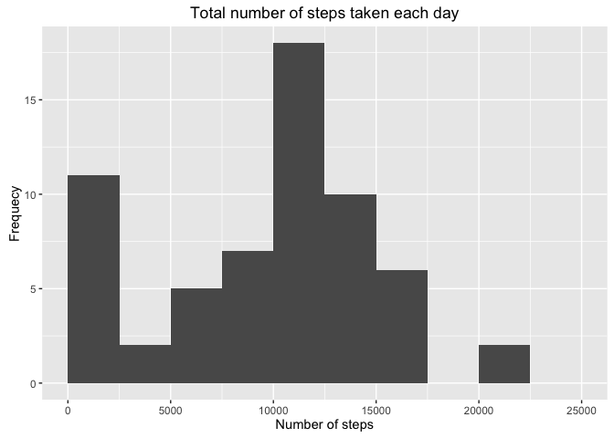
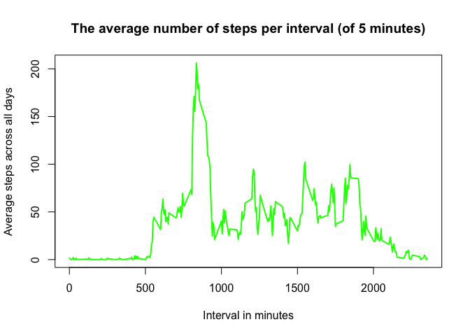
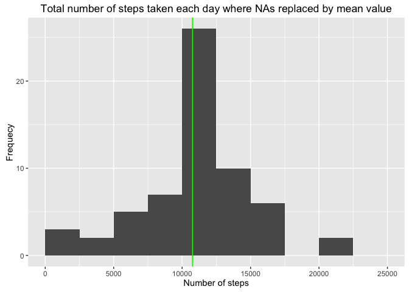
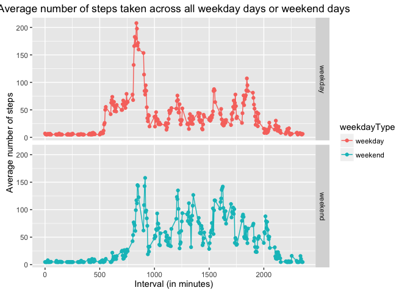

# Reproducible Research: Peer Assessment 1


```r
library(ggplot2)
library(dplyr)
```

## Loading and preprocessing the data

1. Load the data (i.e. `read.csv()`)


```r
df <- read.csv("activity.csv", sep = ",")
```

2. Process/transform the data (if necessary) into a format suitable for your analysis

Converting to date


```r
df$date <- as.Date(df$date, "%Y-%m-%d")
```

## What is mean total number of steps taken per day?

1. Calculate the total number of steps taken per day

We couldn't have used formulas for `aggregate` function like
`aggregate(steps ~ date, data = df, sum)` because days without measurments `NA`
are removed from the final aggregation. The following code keeps those days
with `0` as sum of the steps.


```r
totalStepsByDay <- aggregate(df$steps, by = list(df$date), sum, na.rm=TRUE)
## rename the aggregated columns
names(totalStepsByDay) <- c("date", "totalSteps")
```

2. Make a histogram of the total number of steps taken each day


```r
qplot(totalSteps, data = totalStepsByDay,
      geom = "histogram", breaks = seq(from=0, to=25000, by=2500),
      main = "Total number of steps taken each day",
      xlab = "Number of steps", ylab = "Frequecy")
```



Note: `breaks = seq(from=0, to=25000, by=2500)` sets more readable histogram.

3. Calculate and report the mean and median of the total number of steps taken per day


```r
meanSteps <- mean(totalStepsByDay$totalSteps)
medianSteps <- median(totalStepsByDay$totalSteps)
meanSteps
```

```
## [1] 9354.23
```

```r
medianSteps
```

```
## [1] 10395
```

The mean is **9354.23** where the median is **10395**

## What is the average daily activity pattern?

1. Make a time series plot (i.e. `type = "l"`) of the 5-minute interval (x-axis) and the average number of steps taken, averaged across all days (y-axis)


```r
meanDf <- aggregate(df$steps, by = list(df$interval), mean, na.rm = TRUE)
names(meanDf) <- c("interval", "meanSteps")

plot(meanDf$interval, meanDf$meanSteps, type="l", lwd=2,
     xlab = "Interval in minutes", 
     ylab = "Average steps across all days", col="green",
     main = "The average number of steps per interval (of 5 minutes)")
```



2. Which 5-minute interval, on average across all the days in the dataset, contains the maximum number of steps?


```r
maxInterval <- meanDf[which(meanDf$meanSteps == max(meanDf$meanSteps)), 1]
```

The interval containing the maximum average steps accros all days is **835**.

## Imputing missing values

1. Calculate and report the total number of missing values in the dataset (i.e. the total number of rows with `NA`s.)


```r
totalNas <- sum(!complete.cases(df))
```

The total number of `NA`s is **2304**.

2. Devise a strategy for filling in all of the missing values in the dataset. The strategy does not need to be sophisticated. For example, you could use the mean/median for that day, or the mean for that 5-minute interval, etc.


```r
dfNoNas <- df %>%
           mutate(steps = replace(steps, which(is.na(steps)), mean(df$steps, na.rm=TRUE)))
```

The stratefy is to replace the `NA`s with the **mean** value of the steps.

3. Create a new dataset that is equal to the original dataset but with the missing data filled in.

The new dataset `dfNoNas` was created in the step 2 with the single instruction from library `dplyr`.

4. Make a histogram of the total number of steps taken each day and Calculate and report the mean and median total number of steps taken per day. Do these values differ from the estimates from the first part of the assignment? What is the impact of imputing missing data on the estimates of the total daily number of steps?


```r
totalStepsByDayNoNas <- aggregate(dfNoNas$steps, by = list(dfNoNas$date), sum, na.rm=TRUE)
## rename the aggregated columns
names(totalStepsByDayNoNas) <- c("date", "totalSteps")

## caluclate mean and median values for dataset without NAs
meanStepsNoNas <- mean(totalStepsByDayNoNas$totalSteps)
medianStepsNoNas <- median(totalStepsByDayNoNas$totalSteps)

qplot(totalSteps, data = totalStepsByDayNoNas,
      geom = "histogram", breaks = seq(from=0, to=25000, by=2500),
      main = "Total number of steps taken each day where NAs replaced by mean value",
      xlab = "Number of steps", ylab = "Frequecy") +
  geom_vline(xintercept = meanStepsNoNas, col = "red") +
  geom_vline(xintercept = medianStepsNoNas, col = "green")
```



The **mean** and **median** values of steps taken per day are equal to **10766**. These values differ greatly from the estimates from the first part of the assignemnt because replacing `NA` with mean values of steps creates more data and hence we have bigger mean and median values.

## Are there differences in activity patterns between weekdays and weekends?

1. Create a new factor variable in the dataset with two levels – “weekday” and “weekend” indicating whether a given date is a weekday or weekend day.


```r
weekdayName <- as.POSIXlt(dfNoNas$date)$wday
weekdayType <- ifelse(weekdayName %in% c(0, 6), "weekend", "weekday")

dfNoNas$weekdayType <- weekdayType
```

2. Make a panel plot containing a time series plot (i.e. `type = "l"`) of the 5-minute interval (x-axis) and the average number of steps taken, averaged across all weekday days or weekend days (y-axis). See the README file in the GitHub repository to see an example of what this plot should look like using simulated data.


```r
meanStepsByIntervalAndDayType <- aggregate(steps ~ interval + weekdayType, data=dfNoNas, mean)

qplot(x = interval, y = steps, data = meanStepsByIntervalAndDayType, col = weekdayType, facets = weekdayType ~ .) +
  geom_line() +
  labs(title = "Average number of steps taken across all weekday days or weekend days") +
  labs(x = "Interval (in minutes)", y = "Average number of steps")
```



